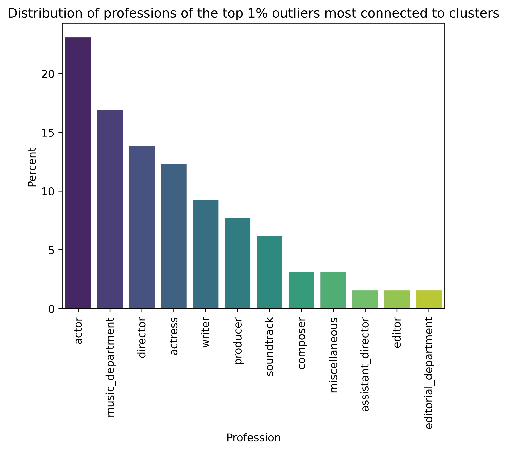
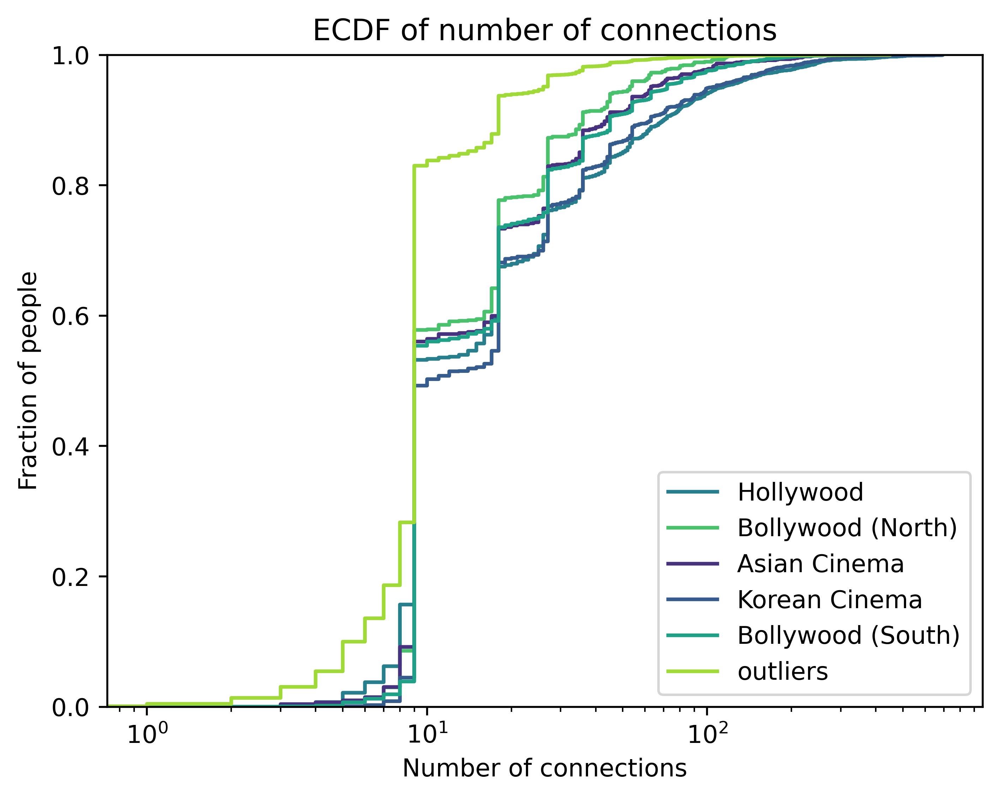

# Outliers

As we saw in the graph part, we have discovered five clusters in our network and, in addition, more than half (53.4%) of our nodes are outliers.
Clusters are interesting, and we looked at them in detail in the previous section, but we can also find out about interesting things concerning outliers.

## Professions

Let us first look at who does what.
In [figure 1](#professions), we show the distribution of professions, both in clusters and outliers. They are sorted in descending order, by the total fraction across both categories.

Our professions data comes from IMDb, and is [generated from the credits](https://help.imdb.com/article/contribution/filmography-credits/what-is-the-profession-order-at-the-top-of-a-name-page/GRGGMPXB46FLC5UN?ref_=helpart_nav_15).

From the graph, we see that there are some notable differences in distribution for both categories.
Producers, executives, managers and writers are significantly more represented in clusters, whilst cinematographers and editors are more represented in outliers.
Actors and actresses are also more present in the outliers.

A possible explanation is that managerial roles are more closely linked to the big film studios, which typically mainly operate in their countries movie industry, whilst actors are more likely to star in movies of different ones.

More interestingly, sound related professions are more nuanced.
Composers, and "sound department" members are much more likely to be in outliers than in a cluster, whilst the "music department" profession is almost equally distributed and the "soundtrack" profession is more represented in clusters.

The other professions are all similarly distributed.

## Ethnicity

Our ethnicity data comes from the CMU dataset, which bases itself on Freebase. We have ethnicity data for only 5% of the people in our data.

Nonetheless, we can still derive some valid conclusions when comparing the differences in distributions between clusters and outliers. This data is represented in [figure 2](#ethnicity).

African Americans and Indians are equally likely to be part of an industry or not. English and British people are more likely to be part of a cluster, likewise for Irish, white and Italian Americans.

We can also comment that Japanese and Swedes are much more likely to be outliers.
This could indicate that both of their native movie industries are big enough to produce many people working in this field, but not big enough to be standalone.
Hence their members often collaborate with people from other movie industry hotspots.

## Connections

Despite us classifying them as "outliers", these people are of course still connected to the graph. Let us compare the connectivity between each category. This is represented in [figure 3](#connectivity)

We see that connectivity is heavy tailed. Additionally, outliers are less well connected than any of the clusters. Interestingly, the distributions are very similar.

As the connectivity distribution is heavy-tailed, we consider the top 1% most connected outliers for our subsequent analysis.
Indeed, it makes sense that outliers are less connected on average than cluster members, otherwise they would have formed a cluster with other outliers, or joined another cluster.
For this reason, the most connected outliers are what is interesting. They are the ones that might be, for example, bridges between clusters. Equally well connected to both, which lead them to not be assigned to either of them.

In [figure 4](#connectivity_top1p) we see that even the top 1% of most connected outliers are not that well connected, with 74.7% of them having less than 100 connections.

[figure 5](#top1p_outliers_graph) shows the location of the top 1% outliers on the graph. We see that some of them are truly isolated, but most of them are close to clusters.

To try an differentiate between the truly isolated outliers and the ones that are just not quite connected enough to join the cluster they are close to, let us differentiate between connectivity to clusters and to other outliers.
We display this difference in [figure 6](#top1p_outliers_connectivity_hexbin).

There are four key takeaways from it:
1. We see that outliers are in general more connected to other outliers, rather than to cluster members. Indeed, 93.4% of all outliers follow this trend, as well as 58.2% of the most connected outliers.
2. Of the most connected outliers, they are in general more connected to other clusters. To be more precise, to the India clusters, as can be seen in [figure 5](#top1p_outliers_graph). They seem to act like bridges between them. We notice that music related professions are over represented compared to the entire dataset ([figure 1](#professions)), which is in line with our conclusions from [the discussion on professions](#professions).
3. There are two notable exceptions: one that is much more connected to outliers and one that has many connections to both. The first one is [Takashi Miike](https://www.imdb.com/name/nm0586281/?ref_=fn_al_nm_1), a Japanese director most known for [13 Assassins](https://www.imdb.com/title/tt1436045/?ref_=nm_knf_t_1). He directed 33 movies, and many more low budget TV series. Which is probably why he has many connections to otherwise not very active people, yielding him his place as an outlier very little connected to clusters (5 connections to Hollywood, 43 connections to Asian Cinema) compared to his 250 connections to other outliers. The second one is [A.R. Rahman](https://www.imdb.com/name/nm0006246/?ref_=fn_al_nm_1), an Indian music composer. Hes is mainly known in the west for his work on [Slumdog Milionaire](https://www.imdb.com/title/tt1010048/?ref_=nm_knf_t_1), for which he won 2 Oscars. He worked on 52 movies, almost exclusively from India. Due to his popularity there, he is very well connected to the two India related clusters (112 and 90 connections respectively), as well as to other outliers (225) connections, due to his involved in music videos and tv series.
4. There are a few outliers that have many connections (>75) but (almost) only to other outliers, but there are almost none that are only connected to clusters. We can see those in [figure 5](#top1p_outliers_graph). They are mostly close to east-asian cinema, and seem to be part of small, isolated clusters that they are the center of.
